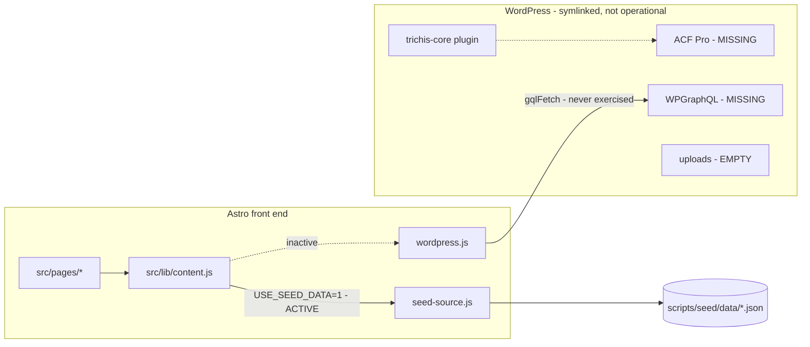

# Trichis CMS audit (step 0)

Audit of `trichis-website` ahead of making the site 100% CMS-driven from WordPress.
References: Plan Brabant (`/Users/fabiantjoe-a-on/code/faab/moan/plan-brabant`) for CMS
architecture, Nine CA (`/Users/fabiantjoe-a-on/code/faab/nine/nine-ca`) for page and block
structure.

---

## 0. Headline finding

**The CMS integration is already about 60% built, and it already follows Plan Brabant's
conventions almost file-for-file.** The brief reads as a greenfield build; it is not.

What exists:

- `wordpress/plugins/trichis-core/` is a direct structural port of Plan Brabant's
  `headless-cpt` plugin: post types, taxonomies, a shared block library, ACF field groups in
  PHP, an options page, a REST forms adapter, a Netlify deploy webhook, an admin menu
  reorder and a WP-CLI seeder.
- `src/lib/{wp-env,graphql,queries,wordpress}.js` are ports of Plan Brabant's data layer,
  including the retry/partial-error `gqlFetch` and the `mapBlocks` normaliser.
- Nine CA's nine content-section record types are already modelled as nine ACF flexible
  content layouts.

What does not exist:

1. **The live WordPress install is empty.** `trichis-core` is symlinked into
   `wp-content/plugins/`, but ACF Pro, WPGraphQL, WPGraphQL for ACF and Advanced Forms are
   all absent, `wp-content/uploads` is 0 bytes, and the seeder has never been run.
2. **The front end never talks to WordPress.** `.env` sets `USE_SEED_DATA=1`, so
   `src/lib/content.js` routes every call to `seed-source.js`, which reads
   `scripts/seed/data/*.json` off disk.
3. **Four of eight routes are hardcoded React**, and they are the ones with the most bespoke
   design: `/`, `/about-us`, `/what-we-do` and `/404`. None of their sections have a block
   equivalent. This is the bulk of the remaining work — roughly twelve new layouts.
4. **There are no SEO fields anywhere**, on any post type or on the options page.
5. **The content in the repo is Nine Creative Agency's**, exported from nine-ca's DatoCMS
   instance. Confirmed with you as placeholder/scaffolding.



---

## 1. Routes and pages

| Route | File | Data source | Renders | CMS status |
|---|---|---|---|---|
| `/` | `src/pages/index.astro` | `getFeaturedProjects()`, `getSiteSettings()` | `HomePage` → `HomeHero`, `HomeWhoWeAre`, `HomeWhatWeDo`, `HomeWhatWeveCreated`, `HowWeDoIt`, `HomeShowReel`, `HomeMore`, `FormSection` | Projects + How-we-do-it cards from CMS. All section copy, the showreel videos and the quickscan form are hardcoded. |
| `/about-us` | `src/pages/about-us.astro` | none | `AboutUsPage` → `AboutUsHero`, `AboutUsIntro`, `AboutUsOffices` | **100% hardcoded.** No CMS call at all. |
| `/what-we-do` | `src/pages/what-we-do.astro` | `getSiteSettings()` | `WhatWeDoPage` → `WhatWeDoHeader`, 5 service sections, `WhatWeDoExpertises`, `HowWeDoIt`, `HomeMore` | Only the How-we-do-it cards come from CMS. Everything else hardcoded. |
| `/projects` | `src/pages/projects.astro` | `getProjects()` | `ProjectsBasicView` | CMS-driven. Only the page `<title>` is hardcoded. |
| `/project/[slug]` | `src/pages/project/[slug].astro` | `getProject()`, `getProjects()` | `ProjectPage` → `ProjectHero`, `DynamicContent`, `ProjectNext` | CMS-driven. Section labels in `ProjectNext` hardcoded. |
| `/service/[slug]` | `src/pages/service/[slug].astro` | `getService()`, `getServices()` | `ServicePage` → `ServicePageHero`, `DynamicContent`, `HomeWhatWeDo` | CMS-driven, but the trailing `HomeWhatWeDo` is hardcoded. |
| `/[...slug]` | `src/pages/[...slug].astro` | `getCustomPage()`, `getCustomPages()` | `CustomPage` → `ProjectHero`, `DynamicContent` | CMS-driven. |
| `/404` | `src/pages/404.astro` | none | `TransitionLink` | Copy from `src/lib/i18n.js` fallbacks; `i18n.overrides.json` is `{}`. |

`getPageByKey()` is implemented in both `wordpress.js:270` and `seed-source.js:52` and
re-exported from `content.js:22`, but **no page calls it**. The `page_key` mechanism that
should drive `/`, `/about-us`, `/what-we-do` and `/projects` is wired on the WP side and dead
on the front end.

---

## 2. Component inventory and candidate layouts

### 2a. Already CMS-driven (accept content as props, contain none)

`CustomPage`, `ProjectPage`, `ProjectHero`, `Project`, `ProjectsBasicView`, `ProjectsGrid`,
`DynamicContent`, `ColumnRow`, `Paragraph`, `PageHeader`, `FormField`, and all of `ui/`
(`SectionTitle`, `ScrollingText`, `SplitText`, `ShuffledText`, `TransitionLink`, `Badge`,
`BorderedIcon`, `Divider`, `AnimatedHoverText`).

Partially CMS-driven, with hardcoded fallbacks: `Menu`, `Footer`, `CookieBanner`,
`CTAFooter`, `HowWeDoIt`, `FormSection`, `ProjectHeader`, `ProjectNumbers`, `ServicePageHero`.

### 2b. The nine layouts that already exist

Defined in `wordpress/plugins/trichis-core/includes/blocks.php`, one flexible content field
`page_blocks` per context, layout keys prefixed `layout_{ctx}_{name}`:

| Layout | Component | Contexts | Sub-fields |
|---|---|---|---|
| `page_header` | `blocks/PageHeader.jsx` | page | `section_title`, `title`, `title_bottom`, `paragraph` (wysiwyg), `cta_text`, `cta_link` |
| `project_header` | `blocks/ProjectHeader.jsx` | page, project | `section_title`, `big_title`, `paragraph_header`, `paragraph` |
| `paragraph` | `blocks/Paragraph.jsx` | page, project | `content` (wysiwyg) |
| `section_line` | `ui/SectionTitle` | page, service | `title` |
| `scrolling_title` | `ui/ScrollingText` | page, service | `text` |
| `column_row` | `blocks/ColumnRow.jsx` | page, project, service | `columns` repeater — see below |
| `project_numbers` | `blocks/ProjectNumbers.jsx` | page, project | `title_left`, `title_right`, `numbers` repeater (`number`, `text`) |
| `cta_section` | `layout/CTAFooter.jsx` | page | `title` (wysiwyg), `cta_text`, `cta_link` |
| `form_section` | `blocks/FormSection.jsx` | page | `title`, `subtitle`, `form_name`, `cta_text`, `success_title`, `success_message`, `form_fields` repeater |

`column_row.columns` repeater sub-fields: `column_type` (select: image/text/empty), `width`
(0–100), `mobile_width` (0–100), `media` (shared media group), `text` (wysiwyg), `align`
(select), `cta_text`, `cta_url`, `cta_is_external`.

Context assignment, `blocks.php:471`:

```php
case 'page':    return ['page_header','project_header','cta_section','form_section',
                        'column_row','project_numbers','paragraph','section_line',
                        'scrolling_title'];
case 'project': return ['project_header','column_row','project_numbers','paragraph'];
case 'service': return ['section_line','scrolling_title','column_row'];
```

### 2c. Components that need new layouts

Twelve new layouts, each named after the component it already maps to. Every field below is
copy that is currently a string literal in JSX.

| Proposed layout | Component | Fields implied by the component |
|---|---|---|
| `home_hero` | `home/HomeHero.jsx` | `media` (desktop), `mobile_media` |
| `home_who_we_are` | `home/HomeWhoWeAre.jsx` | `section_title`, `body` |
| `home_what_we_do` | `home/HomeWhatWeDo.jsx` | `section_title`, `scrolling_text`, `intro`, `services` repeater (`label`, `media`, `link`) |
| `home_what_weve_created` | `home/HomeWhatWeveCreated.jsx` | `section_title`, `scrolling_text`, `intro`, `list_label`, `cta_text`, `cta_link`, project source (featured vs manual) |
| `how_we_do_it` | `home/HowWeDoIt.jsx` | `title`, `cards` repeater (`title`, `text_top`, `text_bottom`), `gl_word` |
| `home_showreel` | `home/HomeShowReel.jsx` | `media`, `mobile_media`, `text_top`, `text_bottom` |
| `link_band` | `home/HomeMore.jsx` | `title` (html), `link` |
| `about_hero` | `about/AboutUsHero.jsx` | `brand_text`, `brand_mobile` |
| `about_intro` | `about/AboutUsIntro.jsx` | `section_title`, `scrolling_text`, `lead`, `cta_text`, `cta_link`, `image_a`, `image_b`, `image_wide`, `body` |
| `offices` | `about/AboutUsOffices.jsx` | `section_title`, `intro`, `offices` repeater (`title`, `address_lines`, `image`) |
| `expertises` | `whatwedo/WhatWeDoExpertises.jsx` | `section_title`, `heading`, `body`, `cta_text`, `cta_link` |
| `service_teaser` | `whatwedo/WhatWeDoService*.jsx` ×5 | `service_name`, `service_name_bottom`, `section_title`, `paragraphs` repeater, `cta_text`, `cta_link`, `media` repeater |

The five `WhatWeDoService*` components (`Identity`, `Strategy`, `Webdesign`, `PhotoVideo`,
`Campaign`) are the same shape with different copy and a different number of media slots.
They collapse into **one** `service_teaser` layout. That is the single biggest de-duplication
win in the refactor.

`how_we_do_it` currently lives on the options page as `homeContent.how_we_do_it`. It should
move to a page layout so it can be placed and reordered, and be removed from Site Settings.

### 2d. Orphan

`components/NiceToMeetYou/index.jsx` is imported nowhere. It references
`/images/meet-us/1.webp` … `27.webp` (39 files exist on disk). Nine CA renders it on project,
service and custom pages; Trichis does not. **Decision needed: delete it and the 39 images, or
wire it up as a layout.**

---

## 3. Hardcoded content

Excludes CSS, animation constants, shaders and GL maths. `L` values verified against the
current working tree.

### 3a. Home

| File | Line | Content | Proposed field |
|---|---|---|---|
| `pages/index.astro` | 11 | `title="Nine Creative Agency"`, `description="Nine is een onafhankelijk creatief bureau."` | `seo.title`, `seo.description` on the Home page |
| `home/HomeHero.jsx` | 18–19 | `/video/showreel_mobile.mp4`, `/video/showreel.mp4` | `home_hero.media`, `.mobile_media` |
| `home/HomeWhoWeAre.jsx` | 8 | `"Who we are"` | `home_who_we_are.section_title` |
| `home/HomeWhoWeAre.jsx` | 11–14 | `"Nine is een onafhankelijk creatief bureau met een culture driven visie…"` | `home_who_we_are.body` |
| `home/HomeWhatWeDo.jsx` | 153 | `"What we do"` | `home_what_we_do.section_title` |
| `home/HomeWhatWeDo.jsx` | 157 | `"You got the vibe, we got the tools."` | `.scrolling_text` |
| `home/HomeWhatWeDo.jsx` | 160–162 | `"Opvallen is niet genoeg…"` | `.intro` |
| `home/HomeWhatWeveCreated.jsx` | 37 | `"What we've done so far"` | `home_what_weve_created.section_title` |
| `home/HomeWhatWeveCreated.jsx` | 40 | `"Discover your impact"` | `.scrolling_text` |
| `home/HomeWhatWeveCreated.jsx` | 42–45 | `"Nine is een onafhankelijk creatief bureau dat de toekomst opnieuw vormgeeft…"` | `.intro` |
| `home/HomeWhatWeveCreated.jsx` | 50, 81, 84 | `"Projects"`, `"All our <strong>projects</strong>"`, `/projects` | `.list_label`, `.cta_text`, `.cta_link` |
| `home/HomeShowReel.jsx` | 11–12, 27, 34 | video paths, `"Watch our"`, `"showreel"` | `home_showreel.*` |
| `home/HomeMore.jsx` | 14, 17 | `"More About <strong>nine</strong>"`, `/about-us` | `link_band.title`, `.link` |
| `home/HowWeDoIt.jsx` | 93 | default `title = "How we do it"` | `how_we_do_it.title` |
| `lib/constants.js` | 20–70 | `QUICKSCAN_FORM`: title, subtitle, cta, success copy, 5 form fields, 10 checkbox options | a `form_section` block on the Home page + an Advanced Forms `form_quickscan` group |

### 3b. About us — entirely hardcoded

| File | Line | Content | Proposed field |
|---|---|---|---|
| `pages/about-us.astro` | 6 | `title="Nine Creative Agency: About us"` | page SEO |
| `about/AboutUsHero.jsx` | 18 | `brandText="nine"`, `brandMobile="n"` | `about_hero.brand_text`, `.brand_mobile` |
| `about/AboutUsIntro.jsx` | 10–11 | `"Als je zegt dat de wereld snel verandert…"` | `about_intro.lead` |
| `about/AboutUsIntro.jsx` | 16 | `"First things first"` | `.section_title` |
| `about/AboutUsIntro.jsx` | 20 | `"Wij zijn nine creative agency."` | `.scrolling_text` |
| `about/AboutUsIntro.jsx` | 29 | `"Contact"` → `mailto:info@9ca.nl` | `.cta_text`, `.cta_link` |
| `about/AboutUsIntro.jsx` | 48, 53, 71 | `/images/about-us/stick.jpeg`, `quincy.jpeg`, `collage.jpeg` | `.image_a`, `.image_b`, `.image_wide` |
| `about/AboutUsIntro.jsx` | 62–63 | `"Al meer dan 20 jaar gaan we hard op creativiteit…"` | `.body` |
| `about/AboutUsOffices.jsx` | 18 | `"Our offices"` | `offices.section_title` |
| `about/AboutUsOffices.jsx` | 22 | `"Bakske of bakkie pleur? Wees welkom in Breda en Rotterdam."` | `.intro` |
| `about/AboutUsOffices.jsx` | 8–13, 27–35 | Rotterdam `Goudsesingel 194` / `3011KD`, Breda `Willemstraat 16` / `4811AL`, two images, titles `R'dam` / `Breda` | `.offices` repeater |

### 3c. What we do

| File | Line | Content | Proposed field |
|---|---|---|---|
| `pages/what-we-do.astro` | 10 | `title="Nine Creative Agency: What We Do"` | page SEO |
| `whatwedo/WhatWeDoPage.jsx` | 14–21 | hero `title`, `header`, `paragraph`, `cta` (`mailto:info@trichis.nl`) | `page_header` layout (already exists) |
| `whatwedo/WhatWeDoHeader.jsx` | 24 | `` `What we do - ${service}` `` pattern | `service_teaser.section_title` |
| `whatwedo/WhatWeDoExpertises.jsx` | 9, 12, 16–19, 21 | `"Our expertises"`, `"Wij zorgen dat merken gezien worden."`, body, `"Contact"` → `mailto:cu@nine.nl` | `expertises.*` |
| `whatwedo/WhatWeDoServiceIdentity.jsx` | 11–16 | `"Identity"`, paragraph, CTA `/service/identity`, `identity1.jpeg`, `identity2.webp` | `service_teaser` instance |
| `whatwedo/WhatWeDoServiceStrategy.jsx` | 12–15, 32–34 | `"Strategy"`, 2 paragraphs, CTA, `strategy.jpeg` | `service_teaser` instance |
| `whatwedo/WhatWeDoServiceWebdesign.jsx` | 17–25 | `"Web-"` / `"design"`, paragraphs, CTA, `webdesign1-3` incl. `.mp4` | `service_teaser` instance |
| `whatwedo/WhatWeDoServicePhotoVideo.jsx` | 17–28 | `"Photo /"` / `"video"`, 3 paragraphs, CTA, `photo.jpeg`, `photo2.mp4` | `service_teaser` instance |
| `whatwedo/WhatWeDoServiceCampaign.jsx` | 13–21 | `"Campaigns"`, 2 paragraphs, CTA, `campaigns.jpeg` | `service_teaser` instance |

### 3d. Chrome, blocks and shared

| File | Line | Content | Proposed field |
|---|---|---|---|
| `layouts/BaseLayout.astro` | 12, 70 | default `title = "Trichis"`, `siteName="Trichis"` | `siteSettings.general.site_name` |
| `layouts/BaseLayout.astro` | 33–37 | title / description / `og:title` / `og:description` / `og:locale` | per-page SEO group + options defaults. No favicon or default OG image exists at all. |
| `layout/NavigationBar.jsx` | 77, 87, 97, 105 | `siteName` default `"Nine Creative Agency"`, `"Menu"`, `"Light"`, `"Dark"` | `uiStrings` |
| `layout/Menu.jsx` | 139–155 | nav fallbacks (Home, About us, Projects, What we do), `+31765156463`, `info@trichis.nl`, LinkedIn/Instagram/Vimeo URLs | already `siteSettings.navigation` + `footer`; remove the fallbacks |
| `layout/Footer.jsx` | 4–7 | `DEFAULT_TITLE`, `DEFAULT_LEAD_HEAD = "Laten we kennismaken"`, `DEFAULT_LEAD_BODY` | `footer.lead_head`, `.lead_body` — **not currently in the ACF options group** |
| `layout/Footer.jsx` | 150, 169, 171, 174 | `"Follow us"`, `"Trichis {year}"`, `aria-label="Juridisch"`, `"→ "` | `uiStrings` |
| `layout/Footer.jsx` | 8–40 | office addresses, socials, legal links (`#`, `/sitemap.xml`) | already `footer.*`; remove fallbacks |
| `layout/CTAFooter.jsx` | 6–7 | `"Klaar voor de <strong>volgende stap</strong>?"`, `mailto:info@trichis.nl` | `footer.cta_*` |
| `layout/CookieBanner.jsx` | 60–65, 73, 79 | title, message, accept, reject, `aria-label`, `"Meer info"` → `/files/privacy-beleid.pdf` | `cookieBanner.*` + a `privacy_document` file field |
| `blocks/ProjectHeader.jsx` | 8–9 | `"About the project"` / `"About the campaign"` | `uiStrings` |
| `blocks/ProjectNumbers.jsx` | 10 | `"It's all about the numbers right?"` | `project_numbers.section_title` |
| `blocks/FormSection.jsx` | 12–21, 55–58, 201, 207 | validation messages, `"Verzenden"`, `"Bedankt!"`, `"Bezig..."` | `uiStrings` |
| `blocks/FormField.jsx` | 76 | `"Selecteer..."` | `uiStrings` |
| `project/ProjectNext.jsx` | 22, 47 | `"What's next"`, `"Neem contact op"` | `uiStrings` |
| `service/ServicePageHero.jsx` | 8, 66 | default `"Web-design"`, `mailto:cu@nine.nl` | remove; already CMS-backed |
| `VideoPlayer.jsx` | 39 | `"Click anywhere to close"` | `uiStrings` |
| `lib/constants.js` | 3–17 | `serviceMap` (5 labels), `SERVICE_IMAGE_URLS` (5 paths) | `service` post type title + featured media |
| `lib/i18n.js` | 5–25 | 14 fallback strings | `siteSettings.uiStrings` |
| `gl/HeroGrid/index.jsx`, `createTextMask.js` | — | default `brandText = "trichis"` | `about_hero.brand_text` / options |
| `gl/HowWeDoIt/HowWeDoItScene.jsx` | 51 | GL mask word `"nine"` | `how_we_do_it.gl_word` |

### 3e. Assets

**Content** (should become WP media):

- `public/images/about-us/*.jpeg` — 5 team and office photos
- `public/images/services/*.webp` — 5 service thumbnails
- `public/images/what-we-do/*` — 10 files, 2 of them `.mp4`
- `public/images/meet-us/*.webp` — 39 files, orphaned with `NiceToMeetYou`
- `public/video/showreel.mp4`, `showreel_mobile.mp4`

**UI chrome** (stay in the repo):

- `public/images/swoosh-a.svg`, `swoosh-b.svg` — decorative overlays, positioned by CSS
- `public/assets/*` — `arrow_light.png`, `blue_noise_rgba_1024.jpg`, `colored_noise_512.jpg`,
  `projects_background_dots.jpg`, `rgba-noise-medium.png`, `transition.jpeg` (all shader inputs)
- `public/fonts/*` — including `RestartSoft-Bold.json` (Three.js typeface)

**Local data files**: `scripts/seed/data/{projects,services,pages,site,assets-manifest}.json`
plus 143 downloaded images (~32 MB, gitignored). These are the DatoCMS export, not authored
content.

---

## 4. Plan Brabant integration, and what still needs porting

Plan Brabant's shape, and Trichis's status against it:

| Plan Brabant file | Trichis equivalent | Status |
|---|---|---|
| `headless-cpt/headless-cpt.php` | `trichis-core/trichis-core.php` | Ported |
| `includes/post-types.php` | same | Ported (`project`, `service`) |
| `includes/taxonomies.php` | same | Ported (`deliverable`) |
| `includes/blocks.php` | same | Ported, 9 layouts — needs ~12 more |
| `includes/field-groups/*.php` | `page.php`, `project.php`, `service.php` | Ported |
| `includes/options.php` | same | Ported, 5 groups |
| `includes/rest-forms.php` | same | Ported (Advanced Forms adapter) |
| `includes/deploy.php` | same | Ported (Netlify build hook, 45s debounce) |
| `includes/admin-menu.php` | same | Ported |
| `includes/cli/migrate.php` | `includes/cli/seed.php` | Ported, never run |
| — | `includes/media-fields.php` | Trichis addition: `trichis_media_group()` for image-or-video assets. Plan Brabant has no equivalent because it has no GL/Mux pipeline. |
| `src/lib/wp-env.js` | same | Ported verbatim |
| `src/lib/graphql.js` | same | Ported verbatim (4 retries, exponential backoff, partial-data tolerance) |
| `src/lib/queries.js` | same | Ported, aligned to the 9 layouts |
| `src/lib/wordpress.js` | same | Ported, plus `mapBlocks` normalising ACF camelCase to Dato-style `__typename` |
| `src/components/blocks/PageBlocks.astro` (registry) | `src/components/blocks/DynamicContent.jsx` | Equivalent, keyed on `__typename` instead of `kind` |
| `scripts/fetch-ui-strings.mjs` + `predev`/`prebuild` hooks | — | **Missing.** `src/lib/i18n.js` and `i18n.overrides.json` exist, but nothing populates the overrides from `siteSettings.uiStrings`. |
| `.env.example` | same | Ported |

**Conventions confirmed and already followed:** field group keys `group_{name}`, field keys
`field_{ctx}_{block}_{name}`, layout keys `layout_{ctx}_{block}`, flexible field always named
`page_blocks`, `graphql_field_name` in camelCase on every group, GraphQL layout typenames
`{Group}PageBlocks{Layout}Layout`.

**Conventions to note:**

- Plan Brabant uses **ACF repeaters for navigation and footer**, not native WP menus. Trichis
  already matches. No WP menu work is needed.
- Plan Brabant has **no GraphQL codegen and no generated types**. Data shapes are defined by
  the mapper functions in `wordpress.js`. Trichis matches. The brief's "type everything / wire
  up the same codegen" therefore resolves to "keep the mapper-defined shapes", since there is
  no codegen to mirror. Both repos are plain JS with `jsconfig.json`, not TypeScript.
- Plan Brabant has **no acf-json directory** — confirmed. Per your decision, Trichis keeps PHP
  local field groups.
- Neither project has SEO fields. This has to be designed fresh.

**Still to port:** `scripts/fetch-ui-strings.mjs` and its `predev`/`prebuild` hooks.

---

## 5. Nine CA mapping

Nine CA's content model lives entirely in `src/common/cms.js`; the block registry is
`src/components/pages/contentSections/index.js:36`.

| Nine CA record | Trichis layout | Match |
|---|---|---|
| `ProjectheaderRecord` (`paragraph`, `paragraphHeader`, `bigTitle`, `sectionTitle`) | `project_header` | Exact |
| `PageheaderRecord` (`sectionTitle`, `title`, `titleBottom`, `paragraph`, `ctaText`, `ctaLink`) | `page_header` | Exact |
| `ParagraphRecord` (`content`) | `paragraph` | Exact |
| `ProjectnumberRecord` (`titleLeft`, `titleRight`, `numbers[]`) | `project_numbers` | Exact. `titleRightSmall` is legacy in Nine CA, destructured but never rendered, and correctly dropped. |
| `ColumnrowRecord` (`columns[]`) | `column_row` | Exact |
| `SectionlineRecord` (`title`) | `section_line` | Exact |
| `ScrollingTitleRecord` (`text`) | `scrolling_title` | Exact |
| `CtasectionRecord` (`title`, `ctaText`, `ctaLink`) | `cta_section` | Exact |
| `FormSectionRecord` (`title`, `subtitle`, `ctaText`, `successTitle`, `successMessage`, `formName`, `formFields[]`) | `form_section` | Exact |

Column types, `ColumnRow.js:14`:

- `ImagecolumnRecord` → `width`, `mobileWidth`, `image` (with `video.streamingUrl`,
  `mp4Url`, `thumbnailUrl`, `muxPlaybackId`)
- `TextcolumnRecord` → `width`, `mobileWidth`, `text`, and on Service only `align`,
  `cta { text, url, isExternal }`
- `EmptycolumnRecord` → `width`, `mobileWidth`

Trichis models all three as one repeater row with a `column_type` select and conditional
fields — a **superset**, since it exposes `align` and `cta` in every context, not just
service. That is an improvement, not a discrepancy.

Width semantics are behavioural, not CMS fields: if desktop widths sum above 100 every column
is forced to 100%; with multiple columns each becomes `calc(var(--width) - 30rem)` to absorb
the gap. `DynamicContent` derives three spacing flags from block adjacency
(`isImageColumnAndNextItemIsImageColumn`, `isJustTextColumn`,
`isColumnRowAndNeedsMoreSpacingBottom`). **These are computed, not authored — they must stay
computed.** The brief's "layout controls that already exist as props" does not apply here.

### Discrepancies

- **Nine CA has no site settings singleton.** Nav, footer, cookie copy, random sentences and
  SEO defaults are all hardcoded in nine-ca. Trichis's options page is already ahead of it.
- **Nine CA has no per-column flexible content.** A column holds leaf fields, not a nested
  block list. See the open question in §7.
- **Project ↔ service relation does not exist in either project.** Nine CA associates them
  implicitly via a hardcoded `serviceMap` of slugs. Nothing in the Trichis design uses such a
  relation.
- **Nine CA has `deliverables` as linked records**; Trichis has a `deliverable` taxonomy.
  Equivalent. Neither has `project_category` or `project_tag`.
- **Nine CA's `seoImage`** is used in `generateMetadata` but never fetched in
  `PROJECT_QUERY` — broken there. Trichis has no SEO fields at all.
- **Nine CA renders `NiceToMeetYou` on project, service and page routes**; Trichis has the
  component but renders it nowhere.
- **Trichis has no equivalent of Nine CA's hardcoded routes** for `/`, `/about-us`,
  `/what-we-do`, `/projects` — both projects hardcode these. Nine CA is not a model for
  making them CMS-driven; that part is new design work.

---

## 6. WordPress install: exists vs to create

### Exists in code, not yet exercised

CPTs `project` and `service`; taxonomy `deliverable`; 9 block layouts across 3 contexts;
field groups `group_page_builder` / `group_project_details` / `group_service_details`;
options page `site-settings` with `navigation`, `footer`, `homeContent`, `cookieBanner`,
`uiStrings`; `trichis_media_group()`; REST forms adapter at
`/wp-json/trichis/v1/forms/{key}`; Netlify deploy webhook; admin menu reorder; WP-CLI
`wp trichis seed [--fresh]`.

### Exists in the live install

Only the symlink:

```
wp-content/plugins/trichis-core -> …/trichis-website/wordpress/plugins/trichis-core
```

`wp-content/themes/` holds default themes only (correct for headless). `wp-content/uploads`
is **0 bytes**. DB is Local's default `local` / `root`. No SQL dump anywhere. Plugin
activation state is unverified — WP-CLI is not installed on this machine and the Local site
was not responding on `http://trichis.local/graphql`.

### To create

1. Install and activate **ACF Pro, WPGraphQL, WPGraphQL for ACF (2.x), Advanced Forms for
   ACF**. Nothing in the plugin registers without ACF.
2. **~12 new block layouts** (§2c) plus their `trichis_blocks_for_context` wiring.
3. **An SEO field group**, cloned onto `page`, `project` and `service`: `seo_title`,
   `seo_description`, `og_image`, `noindex`. Plus options-page defaults
   (`default_og_image`, `title_suffix`, `default_description`, `favicon`).
4. **New Site Settings fields**: `general` group (site name, logo variants), `footer.lead_head`
   and `footer.lead_body`, `cookieBanner.privacy_document`, and `notFound` copy.
5. **Move `homeContent.how_we_do_it`, `.what_we_do`, `.what_weve_created`, `.showreel`** off
   the options page and into the new page layouts.
6. **Route pages**: create `home`, `about`, `whatWeDo`, `projects` pages with the right
   `page_key`, and populate their `page_blocks`.
7. **Run the seeder**, then extend it to cover the new layouts and the four route pages
   (currently `seed.php` creates them as empty shells with only `page_key` set).
8. **Front end**: wire `getPageByKey()` into the four fixed routes, flip `USE_SEED_DATA` to
   `0`, add `scripts/fetch-ui-strings.mjs`.

---

## 7. Open questions

Resolved with you already:

- **Field group storage** — PHP local field groups, matching Plan Brabant and the existing
  plugin. No acf-json.
- **Content** — the Nine CA copy is placeholder. Migrate structure, expect real Trichis copy
  to be authored later.

Still open:

1. **`page_blocks` vs `page_sections`.** The brief names the flexible field `page_sections`.
   Plan Brabant, Nine CA's port and all existing Trichis code use `page_blocks`. Renaming
   touches every layout key, every GraphQL fragment and the mapper. Recommend keeping
   `page_blocks`.

2. **ColumnRows nesting depth.** The brief asks for row → nested column repeater → **a
   flexible content field of block types per column**, reused via **clone fields**. Neither
   reference does this: Nine CA and the current Trichis implementation both use row →
   columns repeater with a `column_type` select and conditional leaf fields. The deeper model
   would need `ColumnRow.jsx`, `queries.js`, `mapBlocks` and `seed.php` rewritten, and would
   let editors build column contents the CSS cannot lay out. Recommend keeping the current
   two-level shape. Confirm.

3. **`anchor_id` on every layout.** No Trichis component renders an id on its section
   wrapper. Cheap to add, but it is new markup on ~21 components. In or out?

4. **Videos and the WebGL pipeline.** All video is currently local files under `public/video`
   or Dato CDN URLs rewritten to R2 by `src/lib/processedSrc.js`. `trichis_media_group()`
   stores Mux/HLS URLs as plain text fields, so WP is only a URL holder, not a video host.
   Three sub-questions: does the showreel become a WP media upload or stay on R2; do
   `NineGLImageElement` textures need CORS headers on the WP/Flywheel host; and
   `processedSrc.js` falls back to `/api/video-proxy?url=…`, **a route that does not exist in
   the repo** — currently masked because `PUBLIC_R2_PUBLIC_URL` is set.

5. **`NiceToMeetYou` and the 39 `meet-us` images.** Orphaned. Delete, or make a layout?

6. **`project_category` / `project_tag`.** The brief lists them; the design uses only
   `deliverable`. Recommend not creating them.

7. **Project → service relation.** The brief says "if the design implies it". It does not —
   neither Nine CA nor Trichis links them. Recommend skipping.

8. **Address inconsistency.** `AboutUsOffices.jsx:12` says Breda is `Willemstraat 16, 4811AL`;
   the footer and `site.json` say Rozenlaan 1. Which is correct?

9. **Missing legal assets.** `CookieBanner.jsx:79` links `/files/privacy-beleid.pdf`, which is
   not in the repo. Footer legal links point at `#`. Real URLs needed.

10. **GL wordmark.** `HeroGrid` defaults to `"trichis"`, `AboutUsHero` overrides to `"nine"`,
    `HowWeDoItScene` hardcodes `"nine"`. Is the hero wordmark editable content or fixed brand
    chrome?

11. **The 404 page.** The brief wants CMS-backed 404 copy. There is no WP page for it. Options
    page group, or a WP page with `page_key = notFound`?

---

## 8. Resolutions

Decisions taken to unblock implementation. The first two were confirmed directly; the rest
adopt the recommendations recorded above.

| # | Question | Resolution |
|---|---|---|
| — | Field group storage | PHP local field groups. No acf-json, matching Plan Brabant. |
| — | Content | Nine CA copy is placeholder. Migrate structure, not brand. |
| 1 | `page_blocks` vs `page_sections` | **`page_blocks`.** Matches Plan Brabant, Nine CA's port and every existing key, fragment and mapper. |
| 2 | ColumnRows nesting depth | **Two levels** (row → columns repeater with `column_type`). Matches both references. A third level would let editors compose columns the CSS cannot lay out. |
| 3 | `anchor_id` | **Added to every layout** via a shared `trichis_anchor_field()` helper, rendered as `id` on each section wrapper. |
| 4 | Video and WebGL | Keep `trichis_media_group()` as a URL holder plus the R2 rewrite. `processedSrc.js` fixed to return the original URL instead of the non-existent `/api/video-proxy` route. CORS is a deployment concern, flagged not solved. |
| 5 | `NiceToMeetYou` + `meet-us` images | **Left in place, not deleted.** Unreferenced, so it costs nothing at build time. Deleting 39 images is destructive and reversible only from git. |
| 6 | `project_category` / `project_tag` | **Not created.** The design uses `deliverable` only. |
| 7 | Project → service relation | **Not created.** Nothing in either design implies one. |
| 8 | Breda address | `site.json` / footer values treated as canonical, since they are already CMS-backed. `AboutUsOffices` seed content follows them. **Still needs your confirmation.** |
| 9 | Legal assets | `privacy_document` file field added; the cookie banner hides the link when it is empty. Real URLs **still needed**. |
| 10 | GL wordmark | Editable: `about_hero.brand_text` / `.brand_mobile` and `how_we_do_it.gl_word`, with the current values as defaults. |
| 11 | 404 copy | **Options page group `notFound`** (title, CTA text, CTA link). There is no WP page to attach it to, and it must resolve without a CMS lookup on a static 404. |
